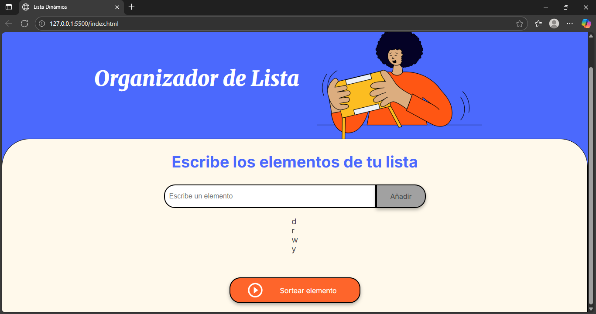

# Organizador de Lista

Una sencilla aplicación web que te permite crear una lista de elementos y luego seleccionar uno al azar. Ideal para sorteos, elegir tareas o cualquier situación donde necesites una selección aleatoria.

## Características

* **Añadir elementos:** Ingresa texto en un campo y añádelo a una lista dinámica.

* **Selección aleatoria:** Sortear un elemento al azar de la lista con un solo clic.

* **Interfaz sencilla:** Diseño limpio y fácil de usar.

## Cómo usarlo

1.  **Abre la aplicación:** Carga el archivo `index.html` en tu navegador web. Verás una interfaz como esta:

    

2.  **Introduce un elemento:** En el campo de texto que dice "Escribe un elemento", escribe el nombre o la descripción de lo que quieres añadir a tu lista.

3.  **Añade a la lista:** Haz clic en el botón **"Añadir"** (el botón gris a la derecha del campo de texto). El elemento que escribiste aparecerá en la lista debajo del campo de entrada.

    

4.  **Añade más elementos:** Puedes repetir los pasos 2 y 3 cuantas veces quieras para añadir todos los elementos a tu lista.

    

5.  **Sortear un elemento:** Una vez que tengas tu lista completa, haz clic en el botón **"Sortear elemento"** (el botón naranja grande).

6.  **Ver el resultado:** Aparecerá una ventana emergente mostrando el elemento que fue seleccionado al azar de tu lista.

    

## Estructura del Proyecto

El proyecto consta de los siguientes archivos principales:

* `index.html`: La estructura principal de la página web.

* `app.js`: Contiene la lógica JavaScript para añadir elementos y realizar el sorteo.

* `style.css`: Define los estilos visuales de la aplicación.

* `assets/`: Carpeta que contiene las imágenes utilizadas en la interfaz.

## Funciones JavaScript Clave

* `añadirElementoALista()`: Captura el valor del input y lo añade a la lista.

* `crearElementoDeLista(contenido)`: Crea un nuevo elemento `<li>` y lo agrega al `<ul>`.

* `elegirElementoAleatorio()`: Selecciona un elemento al azar de la lista y lo muestra en una alerta.

¡Esperamos que disfrutes usando el Organizador de Lista!
